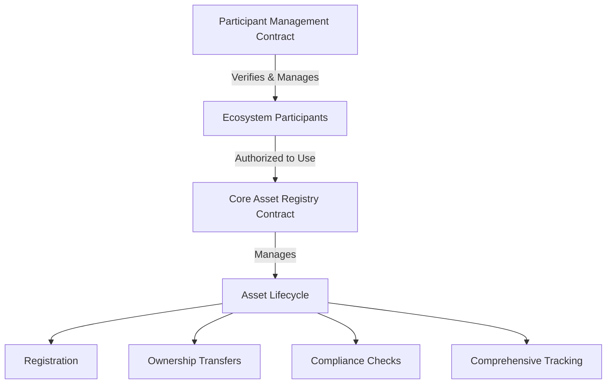

# Immediate Blockchain Standard

A decentralized platform providing transparent and verifiable asset tracking on the Stacks blockchain.

## Overview

Immediate Blockchain Standard enables comprehensive tracking and verification of digital and physical assets across complex ecosystems. The platform allows:

- Authorized participants to register assets with detailed metadata
- Supply chain stakeholders to record asset handling and transfers
- Verification authorities to validate asset qualities and compliance
- End-users to access complete asset history and authenticity proofs

## Architecture

The platform consists of two core smart contracts working synergistically to manage asset lifecycles:



### Participant Management Contract
- Manages participant onboarding and verification
- Implements role-based access control
- Tracks participant reputation and credentials
- Administers system-wide permissions

### Core Asset Registry Contract
- Manages asset registration and comprehensive tracking
- Facilitates secure ownership transfers
- Handles compliance and certification processes
- Maintains immutable event and provenance records

## Contract Documentation

### Farmo Participants Contract

Core functionality for managing supply chain participants:

#### Key Functions:
- `register-participant`: Self-registration for new participants
- `verify-participant`: Verifier approval of participants
- `update-participant-status`: Manage participant status
- `update-reputation-score`: Adjust participant reputation

#### Roles:
- Farmers
- Distributors
- Processors
- Retailers
- Verifiers
- Admins

### Farmo Registry Contract

Handles all product-related operations:

#### Key Functions:
- `register-product`: Create new product entries
- `transfer-custody`: Transfer product ownership
- `add-certification`: Add product certifications
- `record-supply-chain-event`: Log supply chain events

#### Features:
- Unique product identification
- Custody tracking
- Certification management
- Event history

## Getting Started

### Prerequisites
- Clarinet
- Stacks wallet
- Node.js

### Installation

1. Clone the repository
```bash
git clone <repository-url>
cd immediate-blockchain-standard
```

2. Install dependencies
```bash
npm install
```

3. Run local Clarinet chain
```bash
clarinet integrate
```

## Function Reference

### Participant Management

```clarity
(register-participant 
    (entity-name (string-utf8 100))
    (entity-type uint)
    (jurisdiction (string-utf8 100))
    (verification-data (string-utf8 256)))
```

### Asset Management

```clarity
(register-asset 
    (asset-type (string-ascii 50)) 
    (creation-timestamp uint))
```

```clarity
(transfer-asset 
    (asset-id uint) 
    (new-owner principal) 
    (transfer-details (string-utf8 200)) 
    (geo-location (optional (string-ascii 100))))
```

## Development

### Testing

Run the test suite:
```bash
clarinet test
```

### Local Development

1. Deploy contracts:
```bash
clarinet deploy
```

2. Initialize system admin:
```clarity
(contract-call? .participant-management initialize-root-admin)
```

## Security Considerations

### Access Control
- Multi-tier permission hierarchy ensures granular authorization
- Dynamic role-based access control (RBAC)
- Strict verification protocols for all participant interactions

### Data Integrity
- Cryptographically signed asset transactions
- Immutable audit trail for all system events
- Comprehensive provenance tracking
- Tamper-evident record-keeping

### Architectural Safeguards
- Decentralized participant verification
- On-chain governance mechanisms
- Modular contract design for upgradability
- Gas-efficient transaction processing

### Potential Limitations
- Inherent blockchain public transparency
- Performance scaling with system complexity
- Reliance on initial system configuration